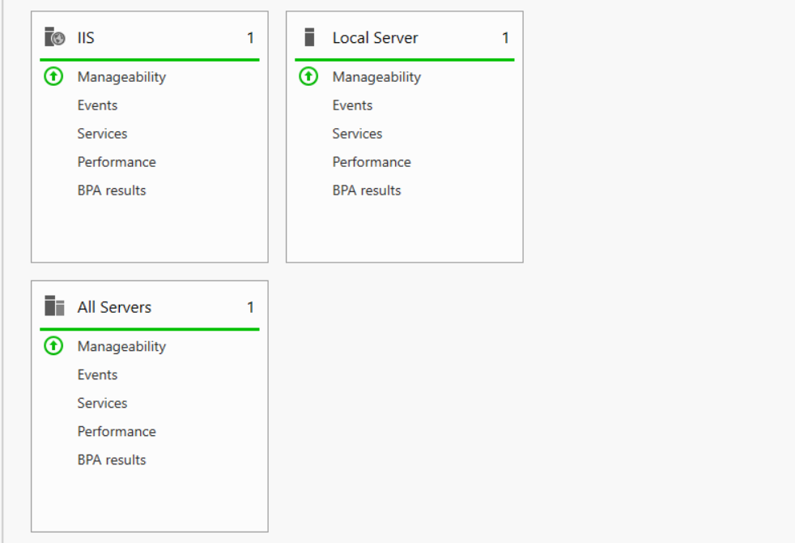
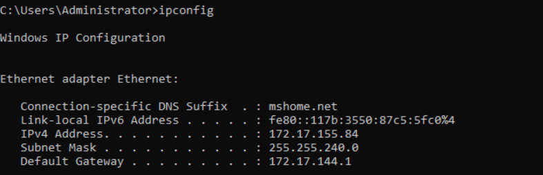

# Windows Server AD
## Overview

This challenge guides you through deploying a secure Windows Server 2022 environment with Active Directory, essential server roles (IIS, DNS, DHCP), user management, Sysmon monitoring, and demonstration of its functionality to a client. Gain essential configuration skills, security awareness, and experience with Active Directory while incorporating user accounts like Alice and Bob for realistic role-based access.

## Learning Objectives:

* Install and configure Windows Server 2022.
* Create and manage user accounts within Active Directory.
* Set up and configure Active Directory for centralized user management.
* Apply granular permissions for users like Alice and Bob based on security principles.
* Install and configure essential server roles (IIS, DNS, DHCP).
* Implement Sysmon for system activity monitoring.
* Analyze Sysm
* on data and present its security value to the client.

### Install and configure Windows Server 2022

**Requirements:**

A virtualization platform (VMware, Hyper-V, VirtualBox, QEMU)
Windows Server 2022 ISO
Installation Steps:

- Create a New Virtual Machine:
- Open your virtualization software.
- Create a new virtual machine with the recommended settings for Windows Server 2022.
- Mount the ISO File:
  - Mount the Windows Server 2022 ISO to the virtual machine's optical drive.

- Repeat for Windows Client

### Create and Manage User Accounts within Active Directory
* Set up and configure Active Directory for centralized user management.
* Apply granular permissions for users like Alice and Bob based on security principles.

Managing user accounts in Active Directory involves creating new user profiles, configuring their properties, and assigning appropriate permissions and group memberships.

- Creating User Accounts:

  - Use the Active Directory Users and Computers tool to add new users.
  Specify essential details like name, logon credentials, and organizational unit (OU) placements.
  Managing User Accounts:

- Adjust user settings including passwords, security options, and profile configurations through their account properties.
  - Control account statuses by enabling or disabling accounts as necessary.
  Security and Group Assignments:

- Set security protocols such as mandatory password changes or password complexity requirements.
  - Manage group memberships to define user roles and access within the network.

### Install and configure essential server roles (IIS, DNS, DHCP).

Installing core server roles such as Internet Information Services (IIS), Domain Name System (DNS), and Dynamic Host Configuration Protocol (DHCP) is crucial for managing web services, resolving domain names, and assigning IP addresses within a network.

- IIS (Internet Information Services):
- DNS (Domain Name System):
- DHCP (Dynamic Host Configuration Protocol):

### Network Connectivity Test

To verify the successful setup and configuration of our network services, a basic network connectivity test was conducted using the ping command between the Domain Controller and the client machine. 

The test results confirmed that there is proper communication between these two critical components of our network. 

This indicates that our DNS and DHCP services are functioning correctly, as they are crucial for resolving domain names and assigning IP addresses, respectively.

The successful ping test ensures that our network infrastructure is robust and ready for further deployment and management tasks.

* IP Config fro; the DC 

* Ping Alice (Administrator) Client

* Ping Bob Client 

## Sysm